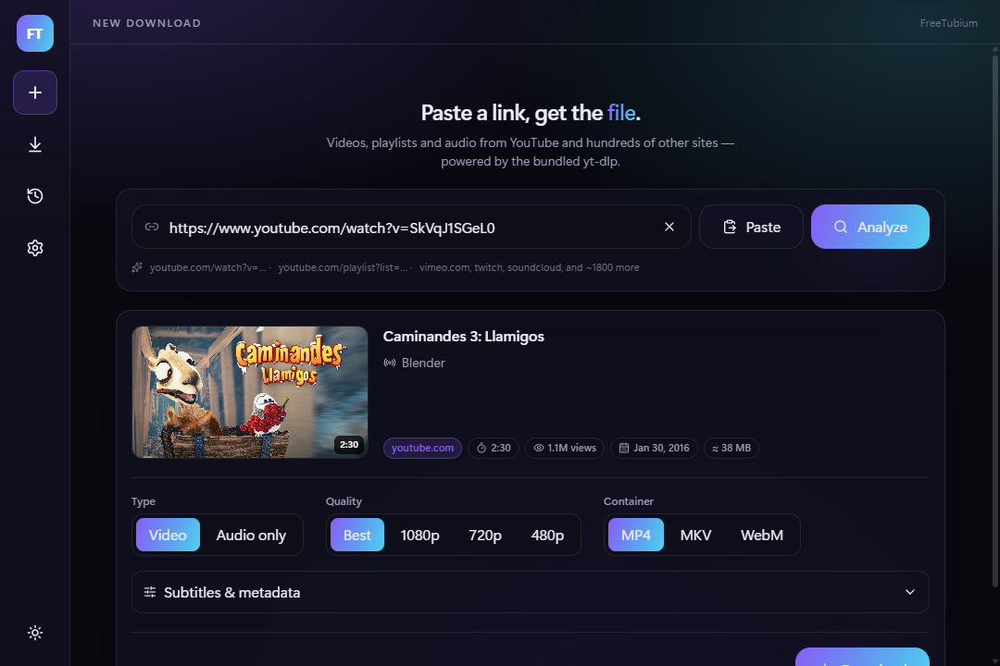
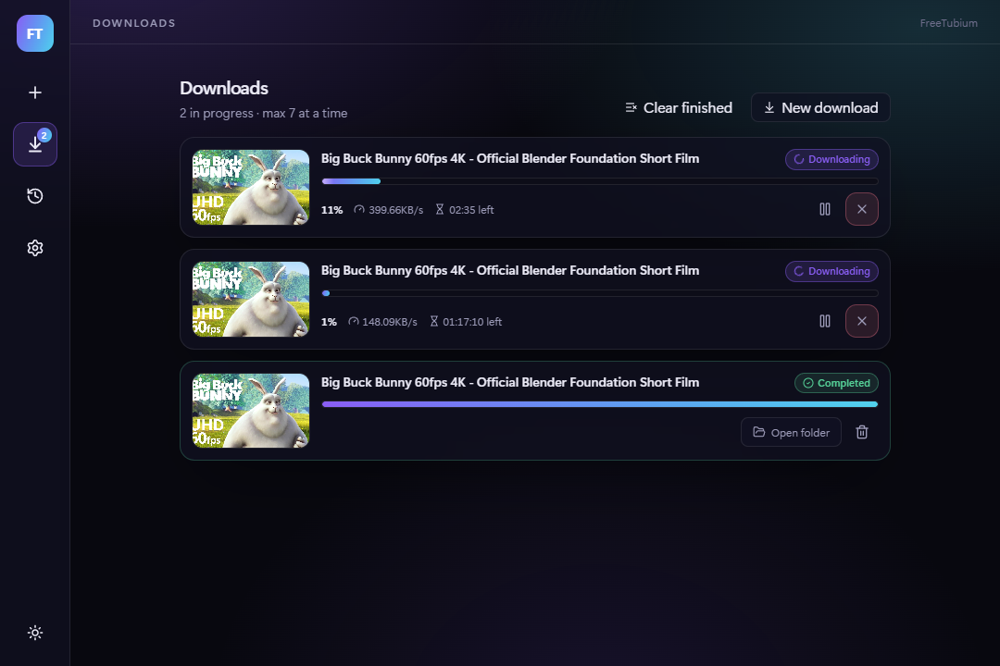
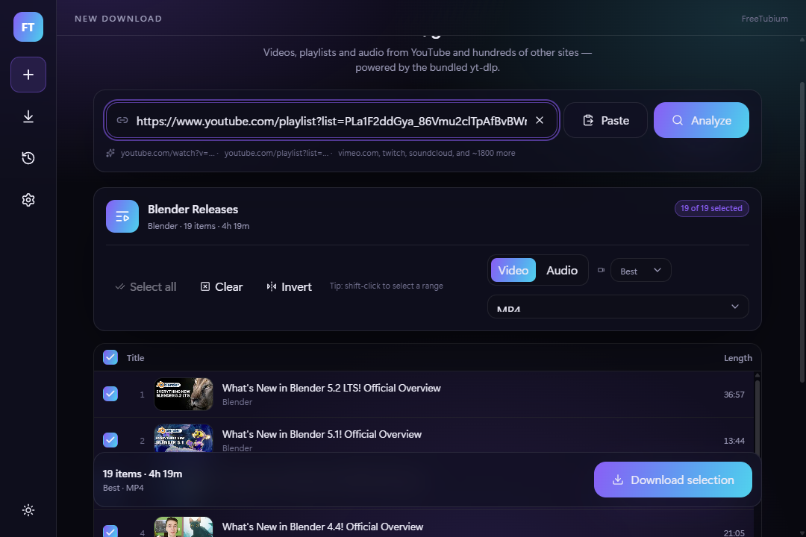
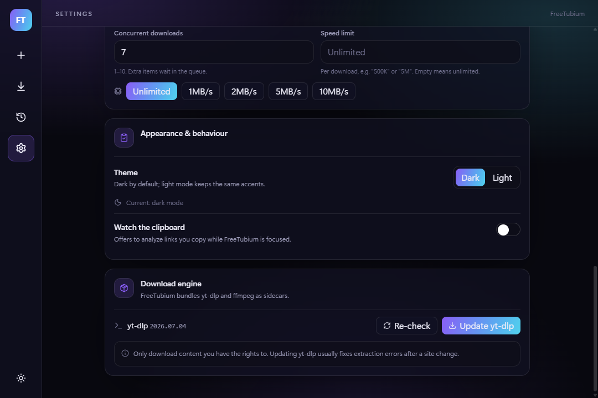

<div align="center">

# FreeTubium

**A fast, modern desktop app for downloading video and audio from YouTube and ~1800 other sites.**

Built on [Tauri 2](https://tauri.app) with a React front end and [yt-dlp](https://github.com/yt-dlp/yt-dlp) + [ffmpeg](https://ffmpeg.org) bundled in — no Python, no command line, no separate installs.

[](https://github.com/TheEvalon/FreeTubium/actions/workflows/ci.yml)
[](LICENSE)

</div>

---

## What it is

FreeTubium is a desktop front end for `yt-dlp`. Paste a link and it fetches the
metadata, shows you the formats that link actually offers, and downloads it with
a live progress bar. Everything runs locally: there is no server, no account,
and no telemetry. Because the download engine is `yt-dlp`, anything it supports
works here too — YouTube videos and playlists, Vimeo, Twitch, SoundCloud, and
roughly 1800 other sites.

The whole app is a ~10 MB native binary that starts instantly and uses the
operating system's own webview instead of shipping a browser.

## Features

**Downloading**
- Paste a URL and get title, channel, duration, view count, thumbnail, and an estimated file size before committing
- Quality picker built from the formats the video *really* has — Best, 8K, 4K, 1440p, 1080p, 720p, 480p
- Choose the output container: MP4, MKV, or WebM
- Audio-only extraction to MP3, M4A, or Opus, with a bitrate choice
- Subtitles: download as separate files and/or embed them, with language patterns
- Embed thumbnail as cover art and write metadata into the file's tags

**Playlists**
- Full playlist analysis in one pass, with every entry listed
- Per-item checkboxes, select-all / clear / invert, and shift-click range selection
- Playlist numbering preserved in filenames
- One bulk quality/format choice applied to the whole selection

**Queue & history**
- Configurable concurrency (1–10 simultaneous downloads)
- Live progress, transfer speed, and ETA per download
- Pause, resume, cancel, and retry — pausing resumes from the partial file instead of starting over
- Optional per-download speed limit
- Searchable history that survives restarts, with watch, re-download, and reveal-in-folder

**Watching**
- A **Watch** page that plays videos and playlists inside the app, without opening a browser
- Playlists become a play queue that auto-advances, with a click-to-jump list
- Videos play in YouTube's own player; anything it refuses — age-restricted, members-only, or embedding-disabled — falls back per item to a local player that extracts the video with the bundled `yt-dlp`
- Save whatever is playing to the download queue in one click
- Play a finished download straight from the History page, with nothing to fetch

**YouTube account (optional)**
- Sign in inside the app, read cookies from an installed browser, or import a `cookies.txt`
- Applies to downloads as well as watching, so restricted videos work everywhere
- Off by default, with the account-restriction risk spelled out before you opt in

**Comfort**
- Dark and light themes
- Optional clipboard watcher that offers to analyze links as you copy them
- Custom output folder and `yt-dlp` filename templates
- Shows the bundled `yt-dlp` version, with a one-click self-update when a site changes and breaks extraction

## Screenshots

### Analyze a link
Paste a URL and pick exactly what you want before downloading.



### Download queue
Live progress, speed, and ETA, with pause and cancel per item.



### Playlist selection
Pick individual entries, or grab the whole playlist at once.



### Settings
Output folder, filename template, defaults, concurrency, and the bundled engine.



## Supported platforms

| Platform | Requirement | Installer |
| --- | --- | --- |
| Windows 10 / 11 (x64) | WebView2 (preinstalled on Windows 11 and current Windows 10) | `.exe` (NSIS) or `.msi` |
| macOS 11+ (Apple Silicon & Intel) | none | `.dmg` |
| Linux (x64) | `webkit2gtk-4.1` | `.AppImage` or `.deb` |

## Install

Grab the installer for your platform from the
[Releases page](https://github.com/TheEvalon/FreeTubium/releases) and run it.

- **Windows** — run the `.exe` (or `.msi`) and follow the installer.
- **macOS** — open the `.dmg` and drag FreeTubium to Applications.
- **Linux** — `chmod +x` the `.AppImage` and run it, or install the `.deb` with
  `sudo apt install ./FreeTubium_*.deb`.

### A note on the security warnings

The release builds are **not code-signed**, because certificates cost money and
this is a free project. Your operating system will therefore warn you the first
time you launch it:

- **Windows SmartScreen** shows "Windows protected your PC". Click
  **More info → Run anyway**.
- **macOS Gatekeeper** says the app "cannot be opened because the developer
  cannot be verified". Right-click the app → **Open**, then confirm; or run
  `xattr -dr com.apple.quarantine /Applications/FreeTubium.app`.

Nothing is wrong with the download — the OS simply cannot tell who built it. If
you would rather not trust a prebuilt binary, build it yourself from source with
the steps below.

## Development

### Prerequisites

- **Node.js 20+** and npm
- **Rust** (stable) via [rustup](https://rustup.rs)
- Platform build dependencies:
  - **Windows** — [Visual Studio Build Tools](https://visualstudio.microsoft.com/visual-cpp-build-tools/) with the "Desktop development with C++" workload, plus [WebView2](https://developer.microsoft.com/microsoft-edge/webview2/) (already present on Windows 10/11)
  - **macOS** — Xcode Command Line Tools (`xcode-select --install`)
  - **Linux** — the WebKitGTK and related packages:
    ```bash
    sudo apt install libwebkit2gtk-4.1-dev libappindicator3-dev librsvg2-dev \
      libgtk-3-dev libxdo-dev libssl-dev build-essential patchelf file wget
    ```

See the [Tauri prerequisites guide](https://tauri.app/start/prerequisites/) if
something is missing.

### Run it

```bash
git clone https://github.com/TheEvalon/FreeTubium.git
cd FreeTubium

npm install            # JS dependencies
npm run fetch-binaries # download the yt-dlp + ffmpeg sidecars for your platform
npm run tauri dev      # start the app (first Rust build takes a few minutes)
```

`npm run fetch-binaries` is required before the first build — `tauri-build`
verifies the sidecars exist at compile time and will fail without them.

### Build installers

```bash
npm run tauri build
```

Bundles land in `src-tauri/target/release/bundle/`.

### Other useful commands

| Command | What it does |
| --- | --- |
| `npm run build` | Typecheck (`tsc`) and build the front end |
| `npm run dev` | Vite dev server alone, without the Tauri shell |
| `npm run fetch-binaries -- --force` | Re-download the sidecars (e.g. to update `yt-dlp`) |
| `npm run check-encoding` | Verify every tracked text file is plain UTF-8 (CI runs this too) |
| `cargo fmt` / `cargo clippy --all-targets` | Format and lint the Rust core (run inside `src-tauri/`) |

### Cutting a release

Release notes are kept in the repo, one file per version, and the Release
workflow publishes the file matching the `version` in `package.json`:

```
docs/release-notes/0.1.0.md   ->  the body of the v0.1.0 GitHub release
```

1. Bump `version` in `package.json` and `src-tauri/tauri.conf.json`.
2. Write `docs/release-notes/<version>.md` (**UTF-8, no BOM** — see below).
3. Tag as `v<version>` and push the tag; the workflow builds all four platforms
   and opens a draft release with those notes attached.

Write the notes as a file in the repo rather than pasting a body into the GitHub
UI or piping one from a shell. On Windows, `>`, `>>`, `Out-File`, and
`Set-Content` in **PowerShell 5.1 default to UTF-16LE**, which produces a body
where every character is followed by a NUL byte. The GitHub web UI hides those
NULs, but the GitHub mobile app renders them, so the notes look like gibberish
there. `npm run check-encoding` catches this, and the release workflow fails
rather than publishing a mis-encoded body. In PowerShell 7+, use
`Set-Content -Encoding utf8NoBOM`.

## How the sidecars work

FreeTubium does not require you to install `yt-dlp` or `ffmpeg`; it ships them as
Tauri **sidecars** — external executables bundled next to the app binary.

`scripts/fetch-binaries.mjs` downloads the right build for your machine and names
it with your Rust host target triple, which is the convention Tauri expects:

```
src-tauri/binaries/
  yt-dlp-x86_64-pc-windows-msvc.exe
  ffmpeg-x86_64-pc-windows-msvc.exe
```

They are listed under `bundle.externalBin` in `src-tauri/tauri.conf.json`, so
Tauri copies them next to the executable during builds (and into the target
directory during `tauri dev`), stripping the triple from the name. At runtime the
Rust core spawns `yt-dlp` through the shell plugin and passes it
`--ffmpeg-location` pointing at the bundled `ffmpeg`, so merging and audio
conversion never depend on anything installed system-wide.

The binaries are deliberately **not** committed to git — they are large and
platform-specific, so `src-tauri/binaries/` is in `.gitignore` and CI fetches
them on every run.

Because the builds come from third-party hosts that go down without warning,
each download is retried with backoff, and ffmpeg on Linux has a second source:
the fully static [johnvansickle](https://johnvansickle.com/ffmpeg/) build is
preferred (no glibc dependency, which matters for the `.deb` and `.AppImage`),
falling back to the GitHub-hosted [BtbN](https://github.com/BtbN/FFmpeg-Builds)
build when that host is unreachable.

Because `yt-dlp` needs regular updates to keep up with site changes, Settings has
a **Update yt-dlp** button that runs the bundled binary's own self-update.

## Watching in the app

The Watch page runs two players behind one queue.

**YouTube's player** handles anything it is willing to embed. It streams from
YouTube directly, so views and ads count normally and FreeTubium does nothing
clever. It is hosted in an iframe served from `127.0.0.1` rather than pointed at
YouTube from the app window: YouTube requires an HTTP `Referer` and shows its
blocked-playback screen (error 153) without one, and the app itself is served
from a custom `tauri://` scheme that cannot provide one. That loopback server
answers only tokenised paths, so no other process on the machine can drive the
player or read what you are watching.

**The local player** handles what the embed refuses. YouTube reports error 101
or 150 for videos whose uploader disallowed embedding, and 100 for videos it
cannot see; each of those switches that one queue item — and only that item — to
the local player, which extracts the video with `yt-dlp`.

The local player has to combine streams before it can play anything. YouTube no
longer offers a single format containing both video and audio, so every rendition
is video-only or audio-only. Preparation downloads one of each and merges them
into an MP4 without re-encoding, preferring H.264 video with AAC audio because
that combination plays reliably in all three system webviews. Prepared files
live in the app cache directory and are deleted when you move on, and on startup.

Playback goes over the same loopback server as the embed, with byte-range
support so the video is seekable end to end. Tauri's asset protocol would be the
obvious choice and is not usable here: WebKitGTK hands media to GStreamer, which
accepts only `blob`, `data`, `file`, `http` and `https`, so an `asset://` URL can
never drive a `<video>` on Linux ([WebKit
146351](https://bugs.webkit.org/show_bug.cgi?id=146351)). `http` works on every
platform.

`yt-dlp` does the downloading and ffmpeg only ever merges local files — the same
division of labour as the download path. That is not just for consistency: the
Linux ffmpeg build is statically linked, which leaves it unable to resolve
hostnames, and it crashes outright if handed an http URL.

**Already-downloaded files** need none of that. Completed entries on the History
page have a **Watch** action that plays the file from disk, so nothing is fetched
and nothing is extracted. It still goes over the loopback server, for the same
reason prepared files do, and releasing it stops the server serving the file
without deleting your download.

## Using a YouTube account

Age-restricted, members-only and private videos need an account. `yt-dlp` can
only authenticate with cookies — its OAuth support no longer works with YouTube
and password login was removed — so Settings → **YouTube account** offers three
ways to supply them:

| Option | How it works | When to use it |
| --- | --- | --- |
| Sign in inside the app | Opens Google's sign-in page in a window, then stores that session's cookies | The simplest path, when Google allows it |
| Read from a browser | Runs `yt-dlp --cookies-from-browser` against a browser you are already signed into | When you are already signed in elsewhere |
| Import a `cookies.txt` | Copies a Netscape-format file exported by a browser extension | When neither of the above works |

Two caveats worth knowing before you start, both from `yt-dlp`'s own guidance:

- **Use a throwaway account.** Using an account this way risks YouTube
  restricting it, temporarily or permanently.
- **`--cookies-from-browser` does not work with Chrome 127 or later,** which
  encrypts its cookie store in a way `yt-dlp` cannot read. Prefer Firefox for
  that option.

Google also sometimes refuses to sign in from an embedded browser with a "this
browser may not be secure" message, which is why the two import paths exist
alongside the in-app one.

Cookies expire, and watching keeps a YouTube session alive in the same cookie
jar, which can prompt YouTube to rotate them. When a video fails for a
sign-in-related reason the app says so and points at the re-capture action. The
stored cookie file grants access to your account, so treat it like a password;
signing out deletes it.

## Architecture

```
React UI  ──invoke──▶  Rust core  ──spawn──▶  yt-dlp  ──▶  ffmpeg
    ◀────── events ─────── (progress / done / error)
```

- **`src/`** — React front end. `src/lib/api.ts` is the single typed contract for
  every command and event; UI code never calls `invoke` directly.
- **`src-tauri/src/`** — the Rust core:
  - `analyze.rs` — metadata via `yt-dlp -J`
  - `downloads.rs` — the download queue, concurrency, progress parsing, cancellation
  - `auth.rs` — YouTube cookies, shared by analyze, download and watch
  - `watch.rs` — picks renditions and remuxes them for the local player
  - `player_server.rs` — serves the embed's host page and prepared files from `127.0.0.1`
  - `store.rs` — settings and history persisted as JSON in the app config directory
  - `ytdlp.rs` — sidecar plumbing

Progress is parsed from `yt-dlp`'s stdout using a custom `--progress-template` and
streamed to the UI as Tauri events.

### Tech stack

| Layer | Choice |
| --- | --- |
| Shell | Tauri 2 (Rust) |
| UI | React 18 + TypeScript |
| Build | Vite 7 |
| Styling | Tailwind CSS 4 |
| Animation | Framer Motion |
| Icons | Lucide |
| Download engine | yt-dlp + ffmpeg (bundled sidecars) |

## Legal & responsible use

FreeTubium is a front end for `yt-dlp`; it does not host, provide, or circumvent
access to any content.

**Only download content you have the right to download.** That means material
you own, content released under a permissive licence (Creative Commons, public
domain), or media you have the copyright holder's permission to save. Respect the
terms of service of the sites you use, and respect copyright law in your
jurisdiction — in many places downloading copyrighted material without
permission is illegal, and a site's terms may prohibit downloading regardless.

The same applies to watching. The Watch page's default player is YouTube's own,
which streams from YouTube on YouTube's terms. The local player exists for
content the embed refuses and it extracts the video rather than streaming it, so
use it only where you would be entitled to download the same video. If you supply
an account, use one you are willing to lose: authenticating `yt-dlp` with it may
breach YouTube's terms and can get it restricted.

You are responsible for how you use this tool. The authors accept no liability
for misuse.

## Contributing

Issues and pull requests are welcome. Please make sure `npm run build` and
`cargo clippy --all-targets` both pass before opening a PR — CI runs both.

## License

[MIT](LICENSE) © FreeTubium contributors.

`yt-dlp` (Unlicense) and `ffmpeg` (GPL/LGPL) are bundled as separate,
unmodified executables and remain under their own licences.
